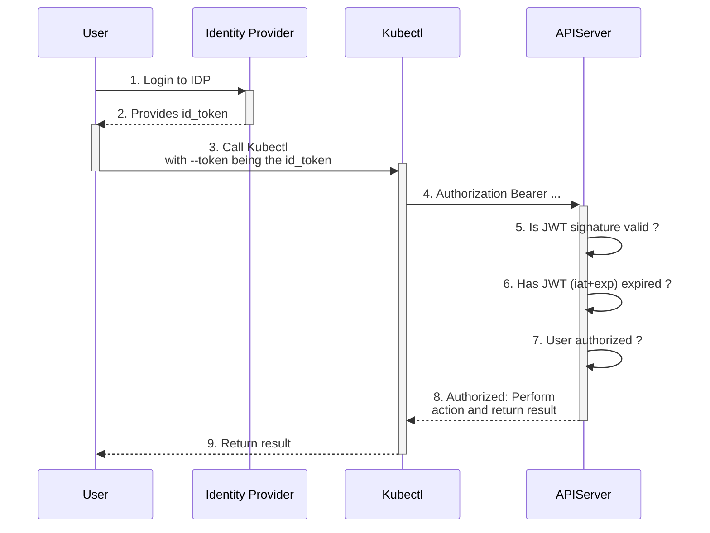

# charts
Charts

```mermaid
sequenceDiagram
    User->>+Identity Provider: 1. Login to IDP
    Identity Provider-->>-User: 2. Provides id_token
    activate User
    User->>+Kubectl: 3. Call Kubectl<br>with --token being the id_token
    deactivate User
    Kubectl->>+APIServer: 4. Authorization Bearer ...
    APIServer->>APIServer: 5. Is JWT signature valid ?
    APIServer->>APIServer: 6. Has JWT (iat+exp) expired ?
    APIServer->>APIServer: 7. User authorized ?
    APIServer-->>-Kubectl: 8. Authorized: Perform<br>action and return result
    Kubectl-->>-User: 9. Return result
```
